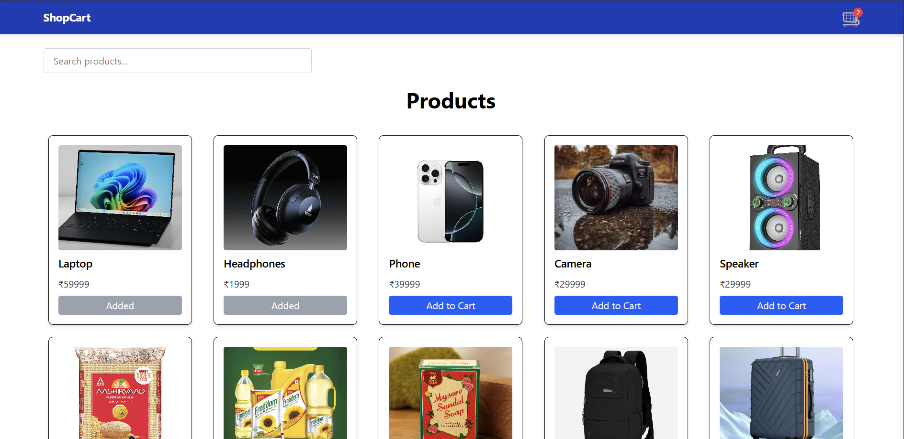
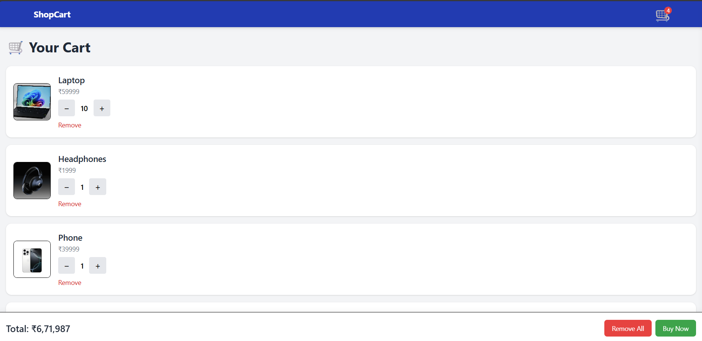

# 🛒 React Redux E-Commerce Product Search App

A modern, mobile-responsive e-commerce product listing application built with **React**, **Redux Toolkit**, and **Tailwind CSS**, featuring dynamic search functionality, cart operations, and persistent state using `localStorage`.

---

## 🚀 Features

- 🖼️ Product listing with responsive grid layout  
- 🔍 Real-time product search by name  
- 🛒 Add/Remove products from cart  
- ➕➖ Increase/Decrease quantity (Max: 10 units)  
- 💾 Cart state persisted with `localStorage`  
- ⚡ Built with Redux Toolkit for clean state management  

---

## 📸 Screenshots

 Home Page

  

 ---

 Cart Page

  |

---

## 🧑‍💻 Technology Used

- **Frontend:** React, Redux Toolkit, Tailwind CSS  
- **State Management:** Redux Toolkit  
- **Persistence:** localStorage  
- **Deployment:** [Vercel](https://food-cart-liart.vercel.app/)

---

---

## ⚙️ Installation & Setup

```bash

git clone https://github.com/dibesh7381/food-cart

cd your-repo-name

npm install

npm run dev
```

---


---


